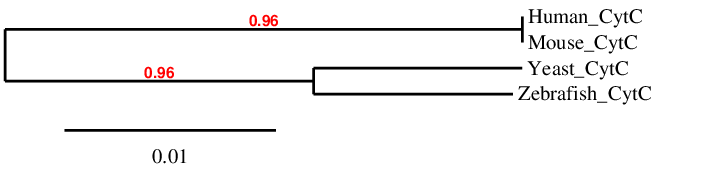

# Phylogenetic Analysis of Cytochrome c Proteins

## 📌 Overview
This project explores the evolutionary relationships between cytochrome c proteins from different species through phylogenetic tree construction using sequence similarity analysis.

## 🔬 Method
- Tool used: Phylogeny.fr (One Click Mode)
- Protein sequences analyzed:
  - Human
  - Mouse
  - Zebrafish
  - Yeast
- Construction of a phylogenetic tree based on protein sequence similarity

## 📊 Key Findings
- Human and mouse cytochrome c proteins clustered closely together
- Zebrafish and yeast formed a separate branch in the generated tree
- The tree demonstrated distinct clustering patterns among the analyzed species

## 🧠 Biological Interpretation
The close clustering of human and mouse proteins suggests a strong evolutionary relationship and higher sequence similarity between these species.

Interestingly, zebrafish and yeast appeared grouped in a separate branch. This observation may reflect sequence similarity patterns, dataset limitations, or alignment-related factors, highlighting the importance of careful interpretation in phylogenetic analysis.

## 🛠 Skills Demonstrated
- Phylogenetic analysis
- Evolutionary interpretation
- Comparative bioinformatics
- Sequence-based relationship analysis
- Use of phylogenetic tools

## 📁 Project Files
- PDF report with detailed explanation
- Phylogenetic tree output image

## 📸 Phylogenetic Tree

